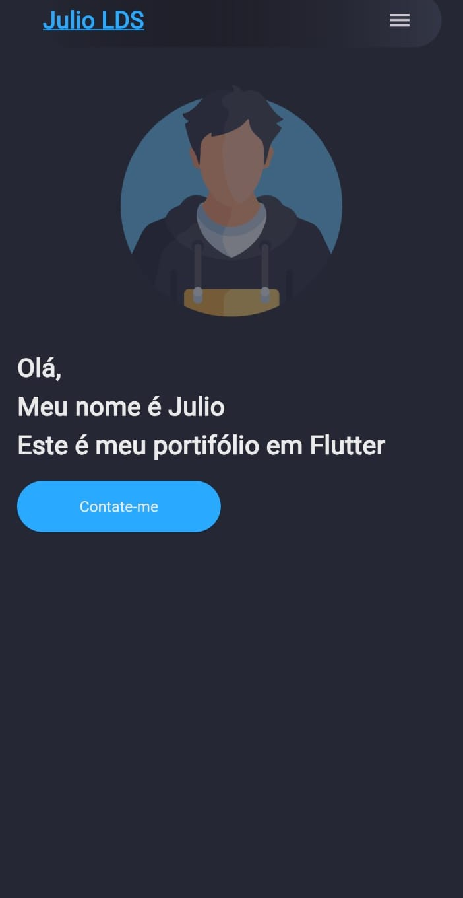
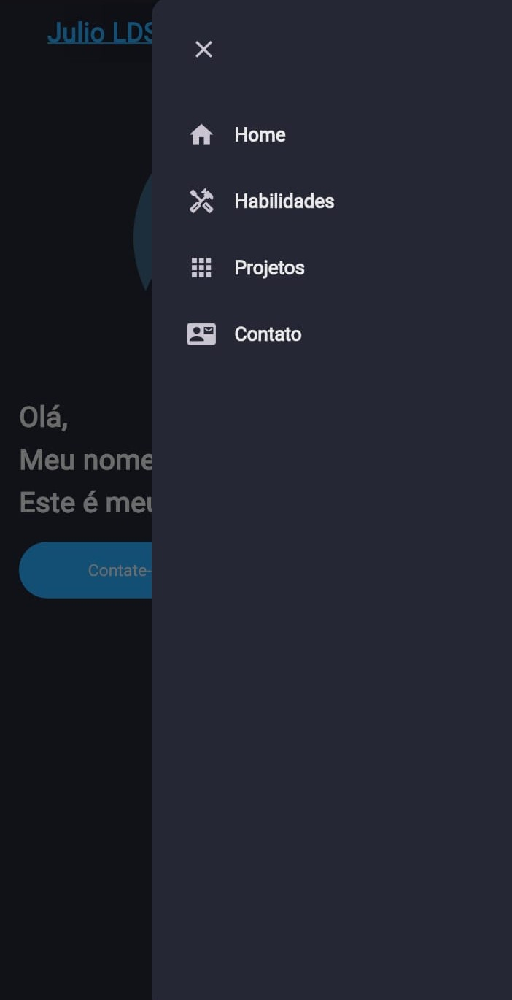
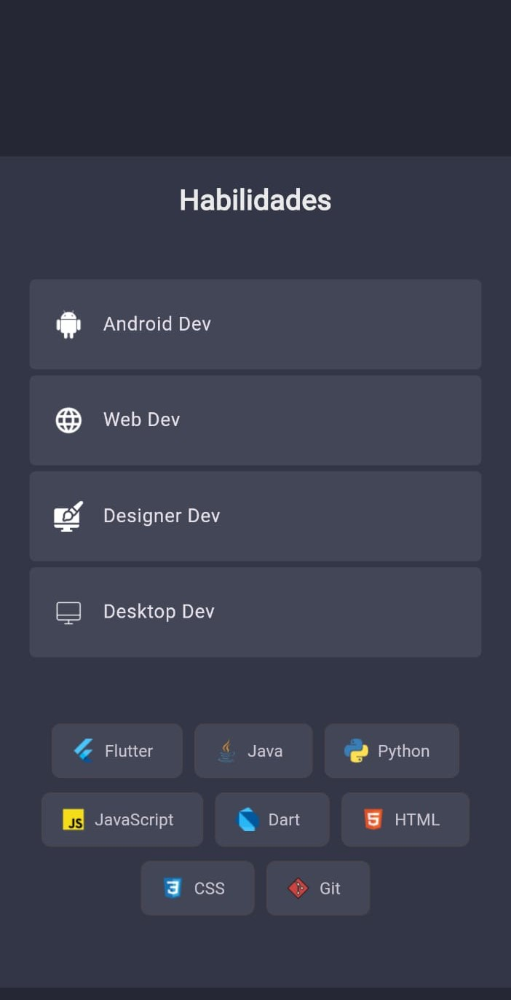
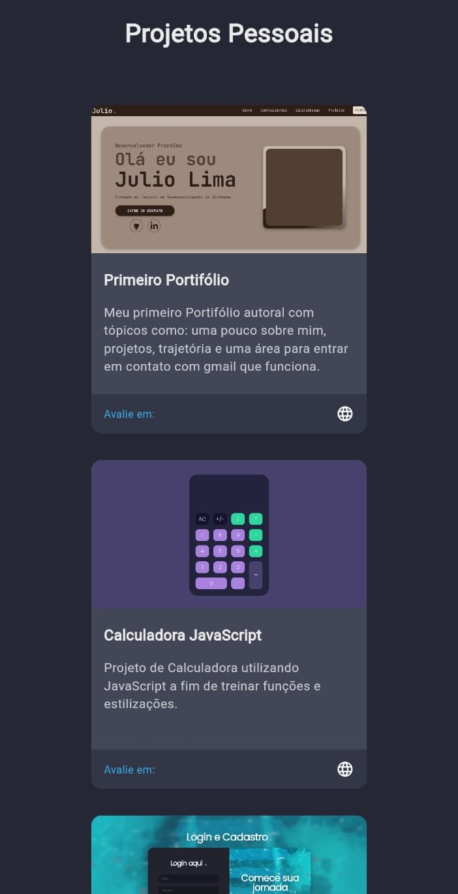
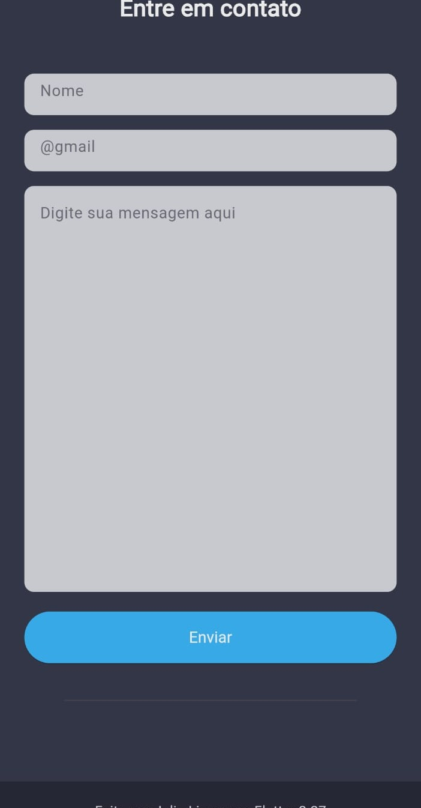

# 📱 Portfólio Flutter

Portfólio autoral desenvolvido em Flutter, com foco em dispositivos móveis. O projeto explora os principais recursos da linguagem e do framework, apresentando uma interface moderna, responsiva e com navegação fluida entre as seções.

---

📌 **Seções principais:**
- 🏠 Início
- 📋 Menu
- 🛠️ Habilidades
- 💼 Projetos
- 📞 Contato

---

🎨 **Tecnologias utilizadas:**
- Flutter
- Dart

---

🚀 **Objetivo do projeto:**
- Praticar e demonstrar conhecimentos em **Flutter** e **Dart**
- Criar um portfólio mobile com navegação intuitiva
- Explorar recursos nativos e widgets do Flutter
- Apresentar projetos e habilidades de forma visual e interativa

---

**📌 Telas do aplicativo**

_Início:_

_Menu:_

_Habilidades:_

_Projetos:_

_Contato:_

🌐 **Veja a página online: https://portifolio-flutter.onrender.com**
